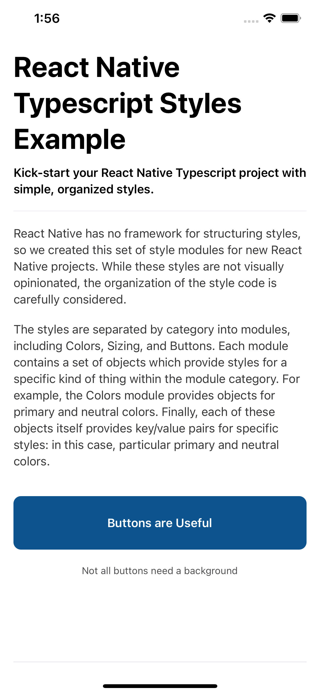
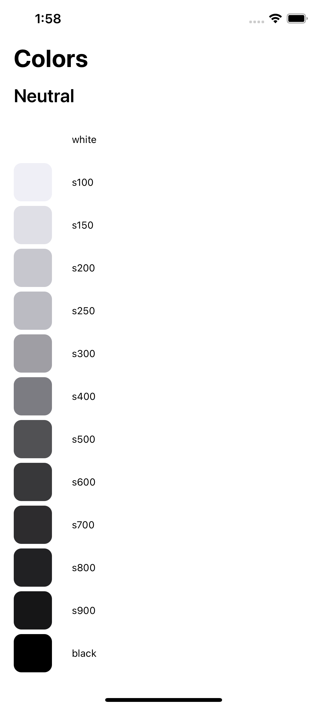
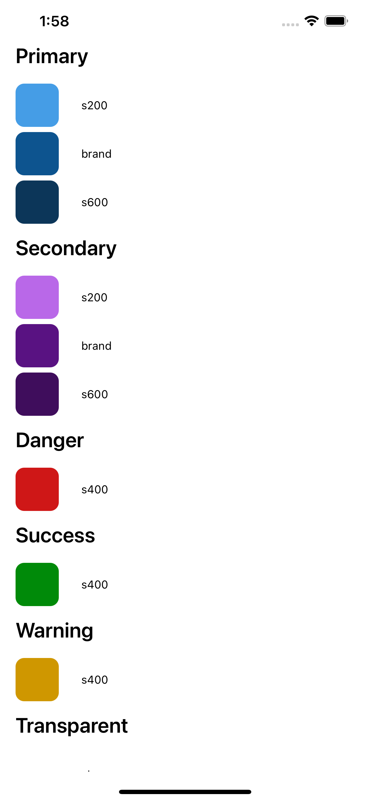

# React Native TypeScript Styles Example

React Native TypeScript Styles is an example project demonstrating how to apply
styles in react native using [react-native-typescript-styles][react-native-typescript-styles].

[react-native-typescript-styles]: https://github.com/thoughtbot/react-native-typescript-styles

## Setup

Install the JavaScript packages

```
yarn install
```

Install the Pods

```
npx pod-install
```

Build and run the app

```
yarn ios

// or

yarn android
```

## Organization

The example app is a single screen with a section for each style module.

### Base Example



### Colors







About thoughtbot
----------------


React Native TypeScript Styles Example is maintained and funded by thoughtbot, inc.
The names and logos for thoughtbot are trademarks of thoughtbot, inc.

We love open source software!
See [our other projects][community] or
[hire us][hire] to design, develop, and grow your product.

[community]: https://thoughtbot.com/community?utm_source=github
[hire]: https://thoughtbot.com/hire-us?utm_source=github
