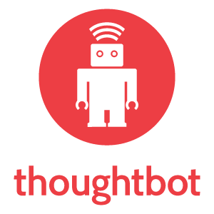

# Logo

Three directions for logos: horizontal, vertical, and circular. The circular logo lacks our name.

### Horizontal

##### Alternate

* [PNG](horizontal/png/horizontal_alternative.png)
* [SVG](horizontal/svg/horizontal_alternative.svg)
* [EPS](horizontal/eps/horizontal_alternative.eps)

### Circular

##### Alternate

* [PNG](circle/png/robot_only_alternative.png)
* [SVG](circle/svg/robot_only_alternative.svg)
* [EPS](circle/eps/robot_only_alternative.eps)

### Vertical

#####  Alternate

* [PNG](vertical/png/vertical_alternative.png)
* [SVG](vertical/svg/vertical_alternative.svg)
* [EPS](vertical/eps/vertical_alternative.eps)

## Guidelines

* Don't use the robot outside of the circle
* Prefer the default horizontal logo for all marketing uses
* If at all possible, use the default color versions of the logo. Only use the
  alternate (white) versions when the default versions have contrast problems with
  the background on which they are being used.
* Use the circular logo, without the company name, on internal branding, or only
  in close proximity with our name or other identifiable branding
* Avoid bisecting the circle of the logo, but if you need to, it's OK. It is
  best to do 3/4 of the logo visible, rather than to bisect the circle in half.
